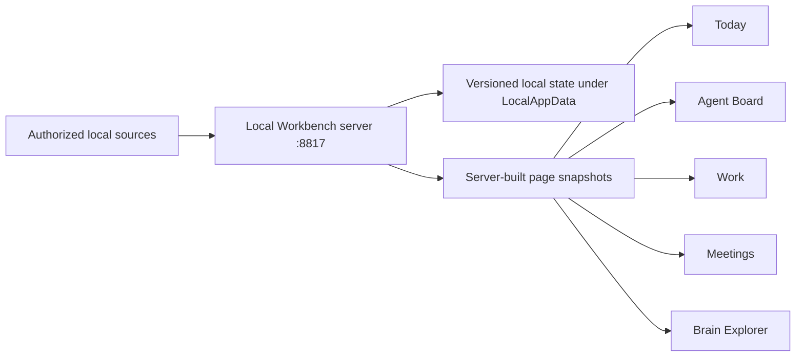

# Workbench Architecture Index

Reviewed: 2026-08-14

This index names the current places to look before changing the Workbench. When an older
document disagrees with this index, treat the older note as history and follow the current
document listed here.

## Current Product

The active product is the IP Corporation Workbench. It is not the May Synthesis Cockpit
prototype by itself, and it is not a separate app from the Brain frontend. The Workbench
shell owns the daily operating experience:

- Today runs the day from a server-built snapshot.
- Agent Board shows work, receipts, source status, and escalation cards.
- Work owns Jira execution, live work state, and exceptions that need Steve.
- Meetings owns prep, capture, source comparison, closeout, follow-up, verified visuals,
  and the bridge from a promise to tracked or active work.
- Brain Explorer owns deeper knowledge work through the current semantic map.

## Active References

| Area | Current reference | Notes |
| --- | --- | --- |
| **Build order** | `docs/architecture/SELF-DRIVING-WORKBENCH-BUILD-PLAN.md` | **Authoritative.** Phases 0 through 8, product success measures, action identity, effect lifecycle, and review levels. Decides what gets built next. |
| Why the order changed | `docs/architecture/reviews/20260815-build-sequence-review.md` | The three-reviewer verdict that stopped the previous sequence. |
| Status, scorecard, source audit | `docs/architecture/SELF-DRIVING-WORKBENCH-REMAINING-BUILD.md` | History for ordering. Still accurate for the status vocabulary, scorecard, meeting source audit, and proof matrix. Its Block A/B/C order is rejected. |
| Earlier roadmap | `docs/architecture/WORKBENCH-ARCHITECTURE-ROADMAP.md` | History. Predates the one-request Today snapshot. |
| Feature donors | `docs/architecture/FEATURE-DONOR-MATRIX.md` | Patterns to port into the Workbench, not apps to run beside it. |
| Prior app survey | `docs/self-driving-workbench-map.md` | Useful donor work from Ghostwork, Mission Control, Praxis, Multica, MRI, and related apps. |
| Loop intent and checks | `docs/loop/00-charter.md` through `docs/loop/04-validation-plan.md` | Current loop work stays in shadow until each module has evidence. |
| Activity reconciliation | `docs/specs/workbench-activity-reconciliation.md` | Full spec for Jira and activity repair. |
| Weekly status comments | `docs/specs/weekly-status-comment-revision.md` | Anchored comment revision on the email preview. Approved, scheduled as Phase 7 item 8, not started. |
| Product vision history | `SYNTHESIS_COCKPIT_VISION.md` | Still useful for Brain Explorer ambition, but no longer the full product shell. |
| Brain processing | `BRAIN_INGESTION_PIPELINE.md` and `GRAPH_DATA_STANDARDS.md` | Active intent, with current status notes for what is not built yet. |
| Safe read models | `DATA_CONTRACT.md`, `src/data.ts`, and `data/frontend-seed.json` | Safe frontend data and static seed shape. |
| Runtime state | `%LOCALAPPDATA%\IPCorpBrain\` | Local app state belongs outside the repo so Vite does not reload tabs mid-work. |
| Launcher | `C:\Apps\IP Corp Brain Launch.bat` | Starts gateway on `127.0.0.1:8817` and Vite on `127.0.0.1:5217`. |
| Design | `context/design-system.md`, `src/App.css`, and current Workbench views | IP Corporation blue and white, cool gray surfaces, corporate/action blues. |

## Current Runtime Shape

The browser should read page snapshots and review models. It should not choose external
actions, call Microsoft 365 during normal page polling, or assemble private source state
on its own.

## Current Technical Decisions

| Topic | Current answer |
| --- | --- |
| Product home | IP Corporation Workbench inside this repository. |
| Visual system | White and cool-gray surfaces, structural navy, corporate/action blues, status colors only for state. |
| Graph experience | Current production direction is the 2D semantic knowledge map. Older 3D language is historical unless re-approved for a specific feature. |
| Launcher and ports | `C:\Apps\IP Corp Brain Launch.bat`, gateway `8817`, Vite `5217`, strict port enabled. |
| Styling | Tailwind v4 utilities-only plus existing custom CSS. No Preflight. |
| Local state | `%LOCALAPPDATA%\IPCorpBrain\`, not repo files while the dev server is running. |
| External effects | None are live yet, and none may go live before Phase 1 Action-Safe State and Phase 4 of the build plan. Review depth then follows consequence, using review levels 0 through 4, not five mandatory passes on everything. Communication classes begin with review and can earn narrow autonomy from measured clean repetitions. |
| Loop mode | Each work class advances separately through observe, draft, reviewed execution, and autonomous execution. There is no global autonomy switch. |
| Visual artifacts | Codex image generation is preferred for meeting visuals. NotebookLM remains available for future artifact types. PPT-like placeholders are rejected. |

## Built Versus Planned

| Area | Built now | Planned next |
| --- | --- | --- |
| Today | One server snapshot with one ID, one capture time, Jira, Agent Board, activity-run, loop state, and partial-source notes. | Move more source stores onto the shared state engine and expand health reporting. |
| Agent Board | Four lanes, cache-only polling, saved ticket runs, source state. | Add convergence rounds, frozen release packages, exceptions, value, impact, and maturity evidence. |
| Meetings | Prep and wrap-up surfaces, multi-source transcript comparison, an eight-step saved closeout job, Codex visual retrieval, exact receipt-selected display, and a retained NotebookLM path. The current index has 123 real meetings, 109 reviewed visuals, and 14 source-blocked meetings with no selected visual. | Make the production image worker restart-safe, recover incomplete historical sources, and build the meeting-to-execution bridge. |
| Meeting-to-execution | Evidence-backed commitments, Jira work, document requests, reminders, and communication drafts are already extracted. | Phase 3 of the build plan: one saved action record per follow-up on a permanent lineage, existing Jira matches suggested, recommendation-only payloads, and truthful run state beside the meeting item. Creating Jira work waits for Phase 4. |
| Activity reconciliation | Proposal/review/apply path, saved run lifecycle, overlap suppression, stop/resume, review-first Jira changes, and review-only email content exist. | Move every source unit onto the shared saved-step engine, close the remaining 14 partial acceptance items, and route clear Jira work through the common action service. |
| Brain Explorer | Current 2D semantic map and sanitized read models. | Repair deeper Brain processing, add richer source evidence, then improve exploration. |
| Self-driving loop | Shadow sense/classification, receipts, standup, Cluely fetch lane. | Deferred to Phases 6 through 8, after the real-meeting pilot measures what actually fails: shadow dispatch, risk-selected review, the staged action and exception service, maturity scoring, foreman cards, memory, and evening retro. |

## Historical Notes

The May documents still matter for ambition, graph philosophy, source evidence, and the
need for strong processing. They do not decide the current shell, palette, launcher,
styling stack, or graph engine. The August Workbench plan is the active path.
