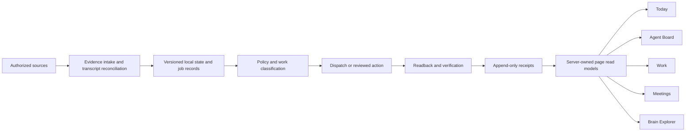

# Workbench architecture roadmap

Reviewed 2026-08-14 against the live code, local runtime, current data, and the full design set.

## Recommendation

Pause new feature work after the current Today and meeting closeout work is verified. The next work should be a foundation sequence, not another page or isolated capability.

The right product shape is:

- Today and Agent Board run the working day.
- Work owns Jira execution and review.
- Meetings owns prep, capture, closeout, and follow-up.
- Brain Explorer owns deeper knowledge synthesis.
- One local server owns collection, jobs, review, receipts, and page read models.
- External effects remain individually reviewed and proven by readback.

## What was reviewed

- `docs/loop/00-charter.md` through `docs/loop/04-validation-plan.md`
- every current file under `docs/loop/ports/`
- `docs/self-driving-workbench-map.md`
- `docs/specs/workbench-activity-reconciliation.md`
- `SYNTHESIS_COCKPIT_VISION.md`
- `BRAIN_INGESTION_PIPELINE.md`
- `DATA_CONTRACT.md`
- `GRAPH_DATA_STANDARDS.md`
- `ARCHITECTURE_PLAN.md`, `EXECUTION_PLAN.md`, and `README.md`
- the live routes, page modules, persisted LocalAppData state, current Brain export, and current build output

## Current reality

| Area | Where it stands | Evidence |
| --- | --- | --- |
| Today | Current Jira, Agent Board, activity-run, and loop state are visible. The reads still arrive as separate snapshots. | `TodayView.tsx` reads four endpoints. |
| Agent Board | The shared work picture is real and cache-only on normal polling. Saved ticket runs now survive a server restart. | Four lanes, source states, links, 60-second cache-only polling. |
| Activity reconciliation | The core run engine exists and the latest live run completed with partial success. | 30 focused server checks pass. The live run produced review items without applying Jira changes or sending mail. |
| Meeting closeout | Multi-source transcript comparison, cleaning, consolidation, repair, and evidence receipts exist. | Teams leads on overlap, Cluely fills gaps, original captures remain stored. |
| Meeting visuals | Codex built-in image generation is now the preferred path. NotebookLM remains an alternative. Local HTML or screenshot placeholders are refused. | A real Codex task produced a reviewed 1672 by 941 PNG. The server retrieves it by exact Codex task ID and verifies its hash. |
| Self-driving loop | Sense and shadow classification are running. Execution is not. | Policy, receipts, shadow scheduler, Cluely fetch, and a morning standup exist. Runtime mode is `shadow`; 98 shadow rows existed at review time. |
| Brain graph | Structurally clean but much thinner than the May claims. | Current file has 155 nodes, 60 links, no dangling links, 5 heuristic links, and no link excerpts. |
| Product docs | Several active-looking documents disagree with the running product. | May docs say dark, 3D, no Tailwind, and the old launcher. Current product is blue and white, 2D, Tailwind utilities plus custom CSS, and `C:\Apps`. |
| Code shape | Working, but concentrated in a few large files. | `server/jira-gateway.mjs` is 3,584 lines, `server/meeting-closeout.mjs` is 2,181, `src/App.tsx` is 1,503, and `src/App.css` is 8,455. |
| Delivery size | Build passes, but the main browser bundle is too large. | Current main JavaScript output is about 1.52 MB before gzip. |

## The main architecture problems

### 1. The written product direction is split

The May cockpit documents and the August Workbench documents describe different products. Both still read as active. That makes any next feature arbitrary because each person can cite a different plan.

Recommended decision: the August Workbench is the product shell. Brain Explorer remains the deep synthesis workspace inside it. The graph is important, but it does not replace Today, Agent Board, Work, or Meetings.

### 2. Today does not receive one coherent server snapshot

Today now shows the right information, but it combines live Jira with three separately timed local reads. A source can change between calls. The page needs one server-owned `TodaySnapshot` with:

- one snapshot ID and capture time
- per-source observed time and state
- Jira priority groups
- delivered, working, and waiting counts
- latest activity run and loop state
- explicit stale or unavailable reasons
- no automatic Microsoft 365 request

This is the architectural fix for the trust problem behind the original complaint.

### 3. Operational state needs strict environment separation

Production, fixture, and test state must never share a LocalAppData file. The live loop ledger currently includes at least one recognizable meeting fixture ID. Every persisted store needs:

- an explicit environment name
- a schema version
- an owner module
- atomic migration
- a test-only root that cannot resolve to the production root
- a redacted health summary

### 4. Meeting closeout is a long job, not one request

Transcript collection, synthesis, Brain storage, image generation, association, and display verification can take minutes and fail independently. Model this as a resumable job with one record per step. Codex and NotebookLM should be image-provider adapters behind that job, with Codex preferred.

No provider failure may create a substitute visual. The meeting stays partially processed until a verified PNG is saved, associated, and displayable.

### 5. The knowledge pipeline does not yet match its own vision

The current graph is valid but sparse, and its links do not carry excerpts. Hierarchical synthesis is still absent. The ingestion work must produce stable IDs, source receipts, relationship checks, community summaries, and run measurements before more graph presentation work.

### 6. Three execution paths repeat the same safety ideas

MDM reconciliation, activity reconciliation, and the Workbench agent each have their own versions of proposals, review, apply, receipts, and readback. The loop will add a fourth unless these become shared server modules.

### 7. The local server and main UI are too concentrated

More loop code should not be added directly to `server/jira-gateway.mjs`. More product routes should not be added directly to `src/App.tsx`. First lock existing behavior with tests, then extract by responsibility without changing what the user sees.

### 8. Navigation and page identity are repeated

View keys, sidebar items, view copy, mobile tabs, and Workbench-agent destinations have overlapping registries. One page definition should own route key, title, icon, navigation group, mobile presence, and agent destination.

## Target architecture

The browser reads page models. It does not assemble private source state, choose external actions, or read the Brain filesystem.

## Ordered build sequence

### Automatic final step for every phase

Each phase ends the same way:

1. Finish the named work and collect current completion evidence.
2. Run the required independent review and repair any finding.
3. Confirm the written completion check with Steve.
4. Once Steve and the builder agree that the phase is finished, automatically run
   `$phase-infographic <phase title>`.
5. Save the approved versioned PNG and its source receipt under
   `docs/architecture/assets/phase-infographics/<phase-id>/`, then link both from the phase
   evidence or closeout record.

Steve does not have to request this step. The shortcut remains available only for a rerun,
replacement, or an explicitly requested partial or blocked status artwork. Creating the image
never changes the phase state and never replaces missing completion evidence.

### Phase 0. Establish one current plan

1. Update `SYNTHESIS_COCKPIT_VISION.md` to the current Workbench product hierarchy.
2. Update `BRAIN_INGESTION_PIPELINE.md` to describe what actually runs and mark hierarchical synthesis as not yet built.
3. Align `DATA_CONTRACT.md`, `README.md`, `ARCHITECTURE_PLAN.md`, and `EXECUTION_PLAN.md` with August reality or label old plans as historical.
4. Add one architecture index that names the current source for product, runtime, data, loop, meeting, and design decisions.

Completion check: no active-looking document gives a conflicting answer about palette, graph engine, launcher, Tailwind, product home, or what is already built.

Automatic final step: after Steve and the builder agree this check is satisfied, create and link
the Phase 0 infographic and receipt.

### Phase 1. Build the truth and state spine

1. Define versioned shapes for source state, jobs, work items, runs, verification, receipts, approvals, and page snapshots.
2. Add strict production, development, and test state roots.
3. Add migration and startup validation for every LocalAppData store.
4. Add a server-owned `TodaySnapshot` assembler and endpoint.
5. Give every page snapshot one ID, capture time, source observations, and partial-result notes.
6. Expand `/healthz` to report code version, snapshot freshness, store health, loop mode, active job count, and last verified completion without private content.

Completion check: Today renders from one coherent snapshot, survives one source failure, and opening it starts no Microsoft 365 work.

Automatic final step: after Steve and the builder agree this check is satisfied, create and link
the Phase 1 infographic and receipt.

### Phase 2. Finish the meeting and visual job model

1. Keep the transcript comparison and consolidated artifact already built.
2. Turn closeout into an explicit resumable step machine: discover, reconcile sources, synthesize, store, generate visual, associate, verify display, finalize.
3. Move long image work out of the request lifetime and into a durable job runner.
4. Formalize image providers: Codex first, NotebookLM available, no local substitute.
5. Store provider task ID, source hashes, output hash, dimensions, review note, and retry history.
6. Add restart and interruption checks at every step, not only after the summary marker.

Completion check: killing the server at any step and restarting repairs only unfinished work, and a meeting is complete only when its real image loads.

Automatic final step: after Steve and the builder agree this check is satisfied, create and link
the Phase 2 infographic and receipt.

### Phase 3. Close the full activity-reconciliation spec

1. Map all 25 acceptance items in `docs/specs/workbench-activity-reconciliation.md` to a named automated check or an explicit live read-only check.
2. Keep Jira changes individually selected, revision-checked, claimed once, and read back.
3. Keep email as internal review content until a separately approved draft or send action.
4. Prove two-tab attach, stop and resume, source failure isolation, late evidence, changed evidence, and no-op suppression.
5. Run the browser path in Chromium and Firefox at laptop and phone widths, including keyboard and reduced-motion checks.

Completion check: the spec has an evidence matrix with no blank acceptance item and a repeat run creates nothing new when the sources did not change.

Automatic final step: after Steve and the builder agree this check is satisfied, create and link
the Phase 3 infographic and receipt.

### Phase 4. Repair the Brain ingestion and synthesis foundation

1. Split graph generation into discovery, source-specific extraction, stable-ID resolution, relationship assembly, source receipt checks, community synthesis, and output validation.
2. Add schemas for every exported read model and the graph.
3. Refuse dangling links, duplicate stable IDs, unsupported relationship types, and high-value links without source evidence.
4. Add hierarchical community summaries and influence measurements as an explicit stage.
5. Emit a run manifest with source counts, changed records, rejected records, confidence distribution, and timing.
6. Rebuild the graph from the current Brain and publish measured results instead of carrying the May numbers forward.

Completion check: a clean full run reproduces the same IDs, every high-value link has source evidence, and the UI can explain how each synthesis result was produced.

Automatic final step: after Steve and the builder agree this check is satisfied, create and link
the Phase 4 infographic and receipt.

### Phase 5. Split the large runtime and UI files

1. Turn `server/jira-gateway.mjs` into a small composition file that registers route modules.
2. Move Jira, Team Library, meetings, activity reconciliation, loop, weekly status, agent runs, and health into owned route and service modules.
3. Split `server/meeting-closeout.mjs` into source reconciliation, synthesis, Brain storage, visual jobs, package inspection, and HTTP routing.
4. Replace the remaining `src/App.tsx` view bodies with feature routes.
5. Split `src/App.css` by feature while keeping shared tokens in one base file.
6. Create one Workbench page registry for navigation, mobile tabs, titles, and agent destinations.
7. Remove unused 3D packages after confirming no current route imports them.
8. Split large browser chunks by route and heavy library.

Completion check: behavior and screenshots stay the same, focused checks remain green after each extraction, and the main browser bundle drops materially.

Automatic final step: after Steve and the builder agree this check is satisfied, create and link
the Phase 5 infographic and receipt.

### Phase 6. Finish the self-driving loop in the spec order

Already built: policy engine, receipts store, shadow scheduler, Cluely fetch, and morning standup.

Build next:

1. Receipts health precheck and test-state isolation.
2. Prompt assembler with frozen briefs and required evidence sections.
3. Dispatcher lifecycle: queue, claim, heartbeat, timeout, bounded retry, restart reconciliation, and isolated worktree for code tasks.
4. Verifier with mechanical, content, and consequence ladders. Only the verifier can mark done.
5. Shared approval channel with exact staged action, diff, approve or decline, claim-once execution, and readback.
6. Foreman escalation cards with failure, location, impact, and repair in flight.
7. Evening retro with token totals, verification rates, failures, and autonomy-tier changes.
8. Memory spine so a run begins with related ticket, meeting, Brain history, earlier receipts, and operating rules.
9. Outlook proof-and-send only after its pure checks, evidence storage, and real per-instance approval path are complete.

Completion check: keep execution dark until every module has its own port spec, red-first check, real flagged exercise, and receipt. Then enable only the two lowest-risk classes for the required observation period.

Automatic final step: after Steve and the builder agree this check is satisfied, create and link
the Phase 6 infographic and receipt.

### Phase 7. Finish the product experience on top of proven data

1. Keep Today as the concise daily operating view.
2. Keep Agent Board as the full work and receipt view.
3. Make Work the single Jira review and execution surface.
4. Make Meetings the single prep and closeout surface.
5. Reframe Brain Explorer around the rebuilt knowledge data and current 2D semantic map.
6. Restore source evidence and processing lineage before adding new graph effects.
7. Finish accessible loading, empty, partial, unavailable, and error states across every page.
8. Add anchored comment revision to the Weekly Status email preview. Selecting any part of
   the rendered email opens a comment at that spot, comments stack as pins in the margin,
   and sending them rewrites only the fields those comments target. Bullets he did not
   comment on come back unchanged. Design approved 2026-08-15 and recorded in
   `docs/specs/weekly-status-comment-revision.md`.

Completion check: every card opens a real record, every stale value names its observation time, no page implies completion without a receipt, and a comment sent against one weekly status bullet leaves every other bullet byte-identical.

Automatic final step: after Steve and the builder agree this check is satisfied, create and link
the Phase 7 infographic and receipt.

### Phase 8. Prove operations and release readiness

1. Make the full local check suite green or record each pre-existing failure with an owner and date.
2. Add fixture smoke coverage for the full daily path.
3. Add a read-only live smoke that records timestamps, response codes, source states, and redacted counts.
4. Add startup recovery checks for a stopped server, stale lock, interrupted job, corrupt store, and disconnected credential drive.
5. Run a two-week shadow observation before enabling any new automatic class.
6. Publish a short operator runbook for stop, resume, repair, backup, and rollback.

Completion check: two consecutive weeks meet the success criteria in `docs/loop/00-charter.md`, with receipts that match spot checks.

Automatic final step: after Steve and the builder agree this check is satisfied, create and link
the Phase 8 infographic and receipt.

## Why this order

| Earlier phase | What it prevents later |
| --- | --- |
| One current plan | Features built for an obsolete product direction. |
| Truth and state spine | Mixed timestamps, fixture pollution, and stale-looking pages. |
| Meeting job model | Long requests, duplicate visuals, and false completion. |
| Reconciliation evidence matrix | A broad workflow reported done from only a few happy-path checks. |
| Ingestion foundation | Beautiful graph work on thin or unsupported data. |
| Runtime split | More logic added to already oversized files. |
| Loop modules | Autonomous execution before verification and approval are ready. |
| Product polish | UI work that masks missing data or receipts. |
| Operations proof | A feature that works once but cannot recover unattended. |

## Recorded, not yet scheduled

### Edit-driven writing improvement

Steve's idea, recorded 2026-08-15. It has no phase yet on purpose.

Every place the Workbench shows generated writing should let him edit it where he already
is, instead of routing every content type into one shared full-screen editor. He rejected
the single-surface version explicitly. A Jira comment gets an inline Edit inside the ticket,
because he rarely opens one and never wants a dedicated page for it. The weekly status email
gets anchored comments on its preview, because he reviews the whole thing once a week. Each
content type gets the editing treatment that suits how often he actually looks at it.

The editor is not the point. On save, a process compares the generated version against his
edited version and uses the difference to improve later writing of that same content type.
Highlighting a word and marking it banned should ban it everywhere from that point on.
Reformatting a paragraph into bullets should teach the register he wants next time.

Today this only happens by hand. The banned word list and voice rules in the global
instructions grow when Steve stops and explains a correction, which is why the 2026-08-07
weekly status rewrite added five terms in one pass and nothing captured the rest. Deriving
the rules from edits he already makes is the version that keeps up with him.

Dependency: this writes to the same voice rules every generator reads, so it needs the
approval channel and receipts from Phase 6 before any rule is allowed to change on its own.
Until then a proposed rule change is review-only.

## Immediate next work block

The next implementation block should contain only these items:

1. Finish the current Today, transcript, and Codex image work with live user-path proof.
2. Complete Phase 0 documentation alignment.
3. Write the Phase 1 state shapes and `TodaySnapshot` spec.
4. Add strict production versus test state-root checks.
5. Implement and prove the single Today snapshot path.

Do not begin the dispatcher or another product feature before those five items are complete.
