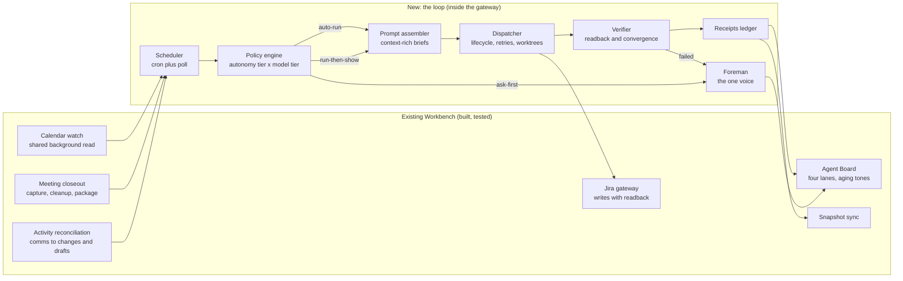

# System spec: stations, modules, and where they live

The loop is five modules inside the existing gateway process plus one UI
surface that already exists. No new services, no new ports, no new
dashboards.

## Module specs

### Scheduler
Walks the same state the Agent Board reads, on a timer (default every 5
minutes) plus wake-on-event where events already exist. Emits work items,
never acts on them. Plain code, no model. Donor shape:
mission-control `scheduler.ts`.

### Policy engine
Pure function: `classify(workItem, history) -> { autonomyTier, modelTier,
toolSet }`. Policy lives in one versioned file
(`server/loop/policy.json`), human-readable, diffable, changed only by
commit. Earned autonomy: a class moves up only on a recorded track record
(N consecutive verified successes), and any verified failure drops it back
one tier automatically. Sends and invites are pinned ask-first and the pin
is not expressible as data anyone can unset; it is code. Donors: ghostwork
`actionEngine.ts` (earned tiers), m365_agent_gateway registry (tool tiers,
write refusal below tier).

### Prompt assembler
Builds the dispatch brief the way the closeout gathers evidence. Every brief
carries: the work item and its links, the meeting package or evidence behind
it, knowledge-base history for the people and topics involved, the operating
rules that bind the output, and the voice profile when prose will be read by
a person. Donors: mission-control `prompt-builder.ts` (assembly shape), MRI
(surround the finding with what depends on it), Praxis prompts (role system
prompts).

### Dispatcher
Owns the run lifecycle: enqueue, claim, start, heartbeat, complete or fail,
report blockers (Multica's lifecycle spec). Retries with backoff; a run that
dies stays visibly dead on the board, never silently reset. Code-writing
work runs in an isolated git worktree per run (Praxis). Concurrency capped;
a runaway-loop check kills agents that stop making progress
(open-multi-agent's loop-detector idea). Model selection comes from the
policy's model tier; local models spawn through CLI adapters with API keys
stripped from the child environment (ghostwork's provider pattern,
mission-control's `security.ts` scrub list).

### Verifier
Decides "done" and nothing else does. Three ladders by consequence:
1. Mechanical: the readback checks the Workbench already uses (Jira
   readback, file existence, structured output shape).
2. Content: verbatim evidence checks, banned-word scan, voice rules.
3. Consequence: convergence, MRI-style; rerun the relevant scan and done
   means the recheck found nothing, across rounds if needed.
A result that cannot be verified is recorded as unverified and routed to
the foreman; it never counts as done.

### Receipts ledger
Append-only record per run: what ran, under which policy version, which
model tier, tokens spent, verification outcome with evidence links, and what
it changed. Feeds the board, the standup, the retro, and the earned-autonomy
counters. Donor: ghostwork `receipt.ts` (the weekly scoreboard idea).

### Foreman
The only voice that addresses Steve. Inputs: escalations from the verifier
and dispatcher, ask-first items from the policy, the daily schedule. Outputs,
all on the Agent Board plus the existing notification path: escalation cards
(what failed, where, what it impacted, the fix in flight, receipt linked),
the morning standup, the evening retro. The foreman writes prose with the
top-model tier and the voice rules, because Steve reads it.

## Integration points (all existing, none new)

| Loop needs | Existing piece it uses |
|---|---|
| Today's meetings and captures | `listTodaysMeetings`, closeout process route |
| Comms evidence | activity reconciliation service and store |
| Jira reads and writes | jira-gateway functions with readback |
| Board rendering | `/api/agent-board` builder (extended with receipts and escalation cards) |
| M365 actions | the Cowork bridge, under the one-job rule, ask-first |
| Snapshot refresh | `shouldRefreshSnapshot` + sync trigger |
| Agent runtime | Claude Agent SDK (already a dependency), CLI adapters for local models |

## What is explicitly not in scope for v1

- No chat control layer changes (the rail agent stays as is).
- No Power BI / Fabric / SQL dispatching until the policy has earned tiers
  for read-only classes first.
- No autonomous outbound anything.
