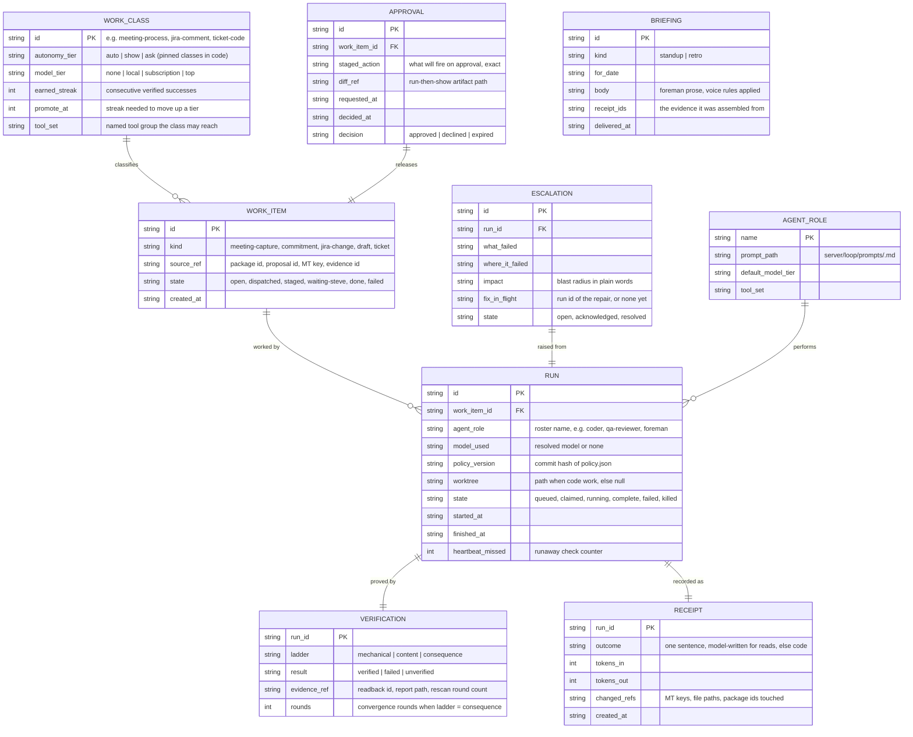

# Data model

One SQLite file owned by the gateway (`%LOCALAPPDATA%/IPCorpBrain/loop.db`),
WAL mode, append-biased. The board reads it; the loop writes it. Nothing
here duplicates state that already lives elsewhere (Jira, packages, the
activity store); rows reference those sources by id and path.

## Rules the schema enforces by design

- A RUN without a VERIFICATION row can never be shown as done; the board
  query joins on verification and renders missing as unverified, amber.
- RECEIPT rows are never updated, only inserted. Corrections are new rows
  referencing the old.
- WORK_CLASS.autonomy_tier for send-class and invite-class actions is not a
  row anyone can edit; those classes are constants in code and the policy
  loader refuses a policy file that tries to override them.
- ESCALATION.fix_in_flight closes the loop Steve asked for: the escalation
  card always knows whether a repair run exists and links it.
- Token columns make cost a per-class weekly query, not an estimate.
