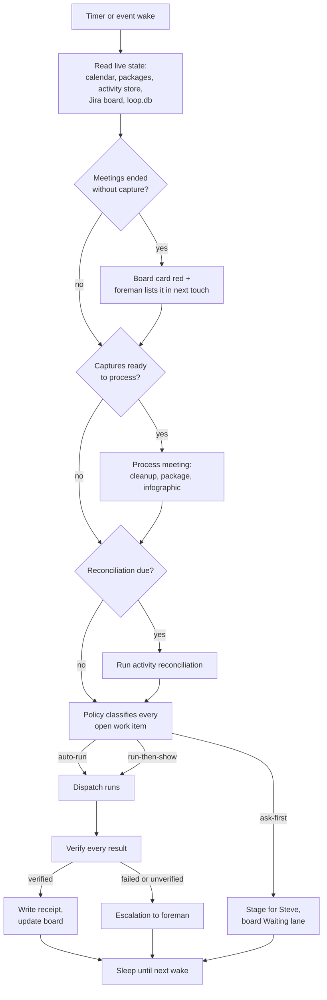
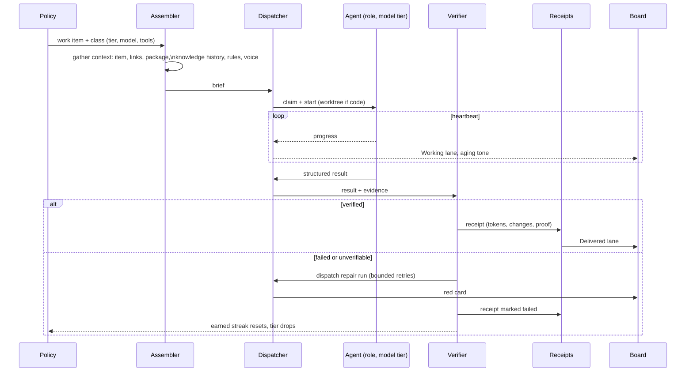
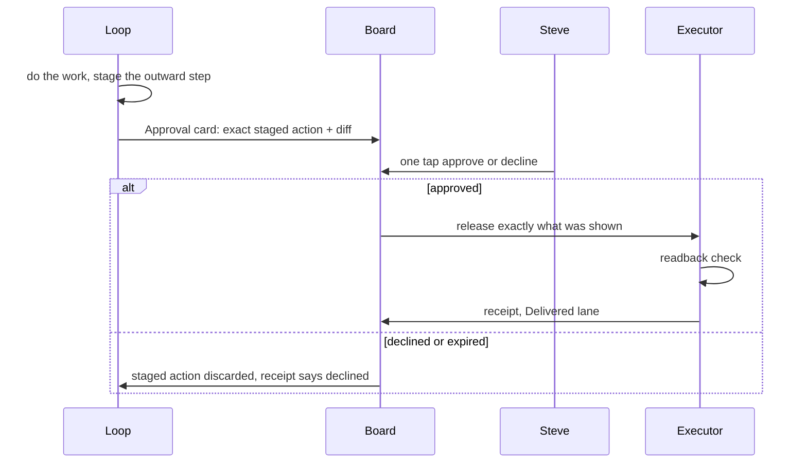
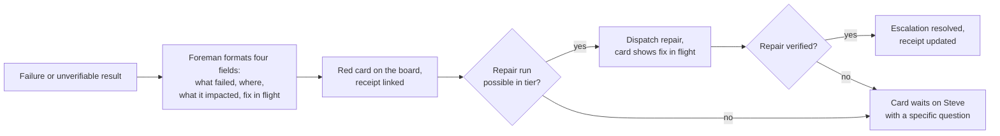
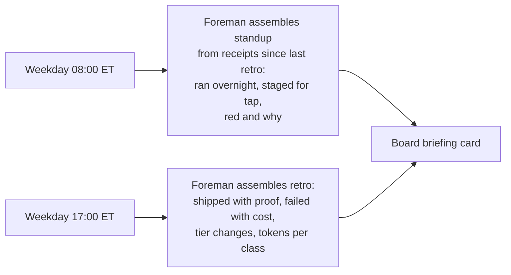

# Workflows

Five flows cover the whole system. Anything not drawn here is not in v1.

## 1. The daily loop

## 2. Dispatch lifecycle (one run)

## 3. Run-then-show approval

## 4. Escalation

## 5. Standup and retro

Both briefings are prose Steve reads, so they run at the top model tier with
the voice rules, and both cite the receipt ids they were assembled from so a
spot check takes seconds.
